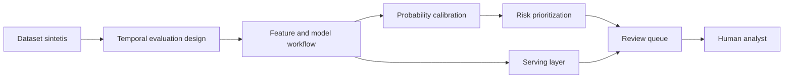

# FraudShield

**AI-assisted fraud risk scoring for bank account-opening applications.**

FraudShield adalah proyek portofolio yang mendemonstrasikan bagaimana model
machine learning dapat membantu tim fraud operations memprioritaskan aplikasi
untuk pemeriksaan manual. Sistem menghasilkan skor risiko terkalibrasi dan
menyusun antrean review berdasarkan kapasitas operasional.

> **Responsible use:** skor adalah sinyal risiko, bukan bukti fraud. Proyek ini
> tidak ditujukan untuk menerima atau menolak aplikasi secara otomatis dan
> tidak boleh dipakai pada populasi nyata tanpa validasi, governance, dan
> pengawasan manusia yang sesuai.

## Sorotan proyek

- Fraud risk scoring untuk account-opening applications.
- Dataset sintetis berukuran 1.000.000 baris.
- Temporal split untuk memisahkan periode pengembangan dan evaluasi.
- XGBoost dengan probability calibration.
- Interpretasi lokal menggunakan TreeSHAP.
- Review queue dengan kapasitas 5%.
- FastAPI dan Flask sebagai konsep serving dan antarmuka.
- Docker sebagai bagian dari tech stack konseptual.

## Hasil evaluasi utama

Hasil berikut berasal dari satu evaluasi pada data sintetis yang ditahan untuk
pengujian:

| Metrik | Nilai |
| --- | ---: |
| ROC-AUC | **0.8954** |
| Average Precision | **0.2135** |
| Brier Score | **0.0129** |
| Expected Calibration Error | **0.0020** |
| Recall @ 5% review capacity | **52.31%** |

Angka ini bukan jaminan performa di lingkungan produksi. Ringkasan metodologi,
hasil, dan batasan tersedia di [docs/](docs/).

## Arsitektur konseptual

Diagram ini sengaja menunjukkan konsep dan trust boundary, bukan detail
implementasi internal.

## Demo dan visual

- [Arsitektur konseptual](docs/architecture.md)
- [Gambar overview](docs/images/overview.png)
- [Video demo](demo/fraudshield-demo.mp4)
- [Demo notes](demo/README.md)

## Batas ruang lingkup showcase

Repository ini adalah showcase recruiter-facing. Source code, dataset kerja,
serialized model, notebook eksperimen, konfigurasi training, payload API,
kontrak feature, dan detail implementasi tidak disertakan.

## Lisensi

Lihat [LICENSE](LICENSE).
