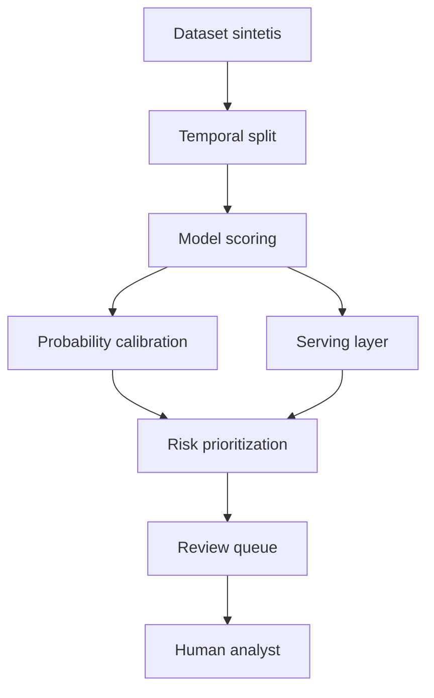

# Arsitektur Konseptual

FraudShield memisahkan lifecycle data science, evaluasi, dan decision support
agar hasil model dapat dibaca dalam konteks operasional tanpa menjadikan model
sebagai pengambil keputusan otomatis.

## Prinsip desain

- Data sintetis digunakan untuk mendemonstrasikan workflow tanpa membuka data
  nasabah.
- Temporal split membantu menguji generalisasi ke periode yang lebih baru.
- Probability calibration membuat skor lebih berguna untuk prioritisasi.
- Kapasitas review 5% menghubungkan hasil model dengan batas operasional.
- TreeSHAP digunakan untuk membantu analyst memahami sinyal lokal model.
- Keputusan akhir tetap berada pada analyst manusia.
- Tidak ada automated rejection atau automated approval.

FastAPI dan Flask ditampilkan sebagai konsep stack aplikasi. Deployment nyata
memerlukan authentication, authorization, TLS, audit trail, monitoring drift,
load testing, dan security review.
